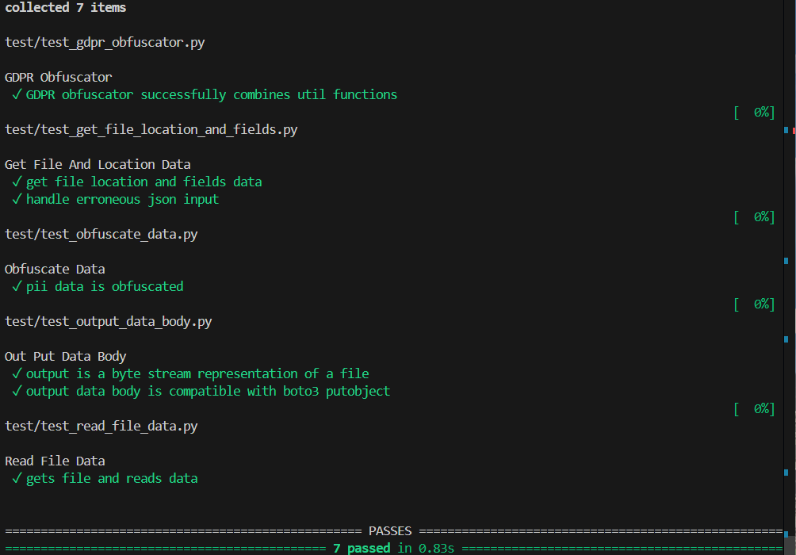
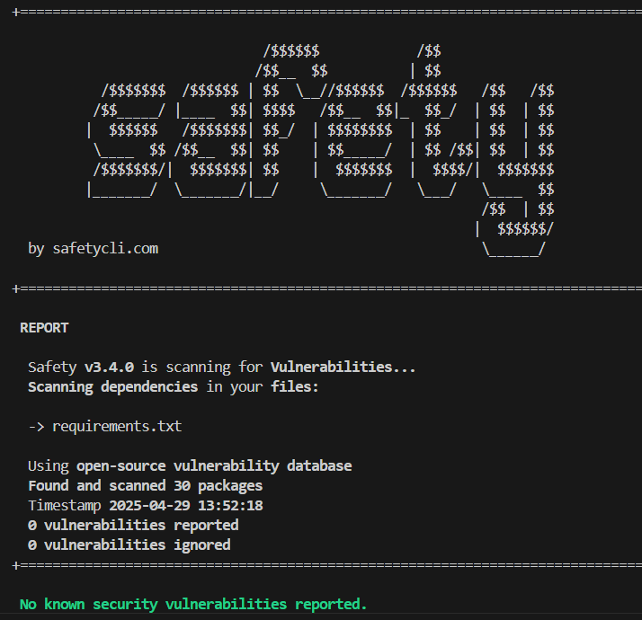
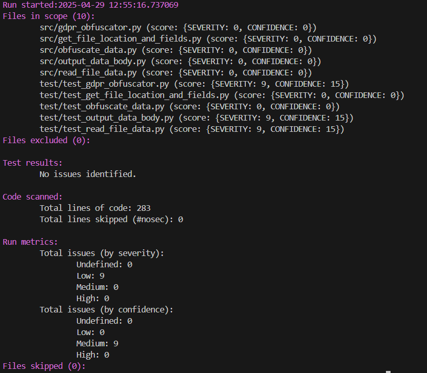

# GDPR Obfuscator Project
This project contains a general-purpose obfuscation tool (python function) to censor personally identifiable information (PII) in data being stored in AWS S3 storage, in line with requirements under [GDPR](https://ico.org.uk/media/for-organisations/guide-to-data-protection/guide-to-the-general-data-protection-regulation-gdpr-1-1.pdf) to ensure that all data containing information that can be used to identify an individual should be anonymised. 

## Assumptions and Prerequisites
1. Data is stored in a CSV-formatted file in an AWS S3 bucket.
2. Fields containing GDPR-sensitive data are known.
3. Data records will be supplied with a primary key.

## How it Works / How to Use
1. The tool should be supplied with: the S3 location of the file containing sensitive information; and the names of the PII fields, in the form:
```json
{
    "file_to_obfuscate": "s3://my_ingestion_bucket/new_data/file1.csv",
    "pii_fields": ["name", "email_address"]
}
```
2. The tool will return a python object (a byte-stream object) containing an exact copy of the input file but with the sensitive data replaced with obfuscated strings. 

The output object is compatible with the `boto3` [S3 Put Object](https://boto3.amazonaws.com/v1/documentation/api/latest/reference/services/s3/client/put_object.html) function.

## Example Case
The target CSV file might look like this:
```csv
student_id,name,course,graduation_date,email_address
...
1234,'John Smith','Software','2024-03-31','j.smith@email.com'
...
```

The output will be a byte-stream representation of a file like this:
```csv
student_id,name,course,graduation_date,email_address
...
1234,'***','Software','2024-03-31','***'
...
```

## Robustness
The tool has been unit-tested, it is PEP-8 compliant (via black and flake8), and it has been tested for security vulnerabilities (via safety and bandit).





